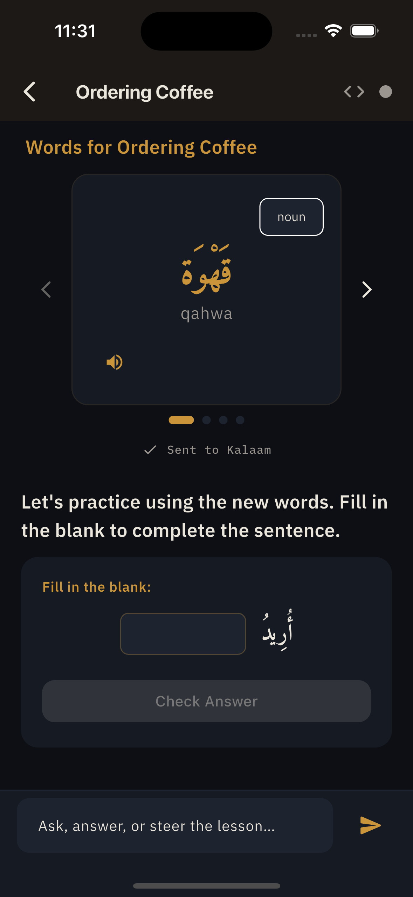
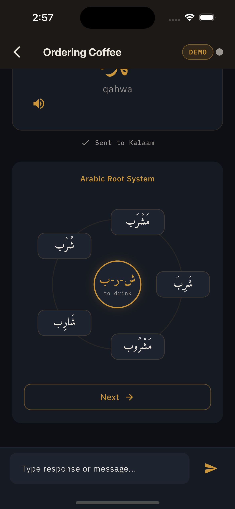
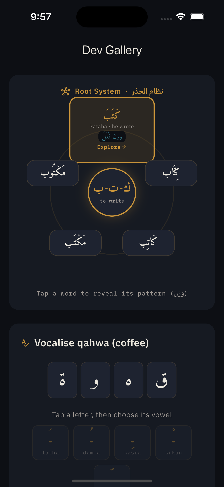

<div align="center">

# Kalaam · كلام

### An Arabic tutor whose UI is composed live by Gemini.

**Kalaam is a Flutter showcase for the [GenUI SDK](https://pub.dev/packages/genui) (A2UI v0.9).**
There is no fixed lesson UI — a Gemini model *generates the interface at runtime*,
assembling each step of an Arabic lesson from a catalog of widgets and adapting to
what the learner does.

[](https://github.com/OWNER/kalaam/actions/workflows/ci.yml)
[](LICENSE)
[](https://flutter.dev)
[](https://pub.dev/packages/flutter_lints)

</div>

> [!NOTE]
> Replace `OWNER` in the badges/links with your GitHub org or user after the first push.

---

## What this is

Most apps ship a fixed screen for every state. Kalaam ships a **vocabulary of widgets**
and lets the model decide what to render. Pick a scenario (or type a goal like *"bargaining
in a Cairo market"*) and Gemini composes a multi-widget Arabic lesson — a scene-setter,
flip-card vocab, the **triliteral-root diagram**, a vowel-placement trainer, conjugation
tables, quizzes, roleplay — reacting to each answer in real time.

A built-in **Live GenUI Inspector** (the `</>` button) streams the raw [A2UI](https://github.com/google/A2UI)
JSON the model emits, so you can literally watch *"this JSON became that widget."*

<div align="center">
<!-- Tip: record a GIF of a live lesson + the Inspector and replace demo.png with demo.gif. -->

&nbsp;

&nbsp;

</div>

## Why it's a GenUI showcase

- **The model builds the UI.** Gemini emits A2UI `createSurface` / `updateComponents`
  messages that compose **genui primitives** (`Column`, `Row`, `Card`, `Text`, `Button`…)
  with **custom Arabic teaching widgets**.
- **The loop is bidirectional.** Every interactive widget dispatches a `UserActionEvent`;
  the model sees the answer and adapts (a wrong quiz → a targeted pronunciation drill).
- **The data model is live.** Correct answers push `updateDataModel`, animating the mastery
  ring **without rebuilding the screen** — the SDK's signature trick, made visible.
- **It streams.** Surfaces appear as tokens arrive; the Inspector shows JSON resolving into
  typed UI.

## Run it

### Option A — Demo Mode (no Firebase, ~30 seconds)

The fastest way to see the showcase. Replays a curated lesson through the *real* GenUI
pipeline — no API key, no backend.

```bash
flutter pub get
dart run build_runner build --delete-conflicting-outputs
flutter run --dart-define=KALAAM_DEMO=true
```

### Option B — Live (Gemini composes in real time)

Bring your own Firebase project — **never** use someone else's. Config is git-ignored;
you generate it locally.

```bash
flutter pub get
dart run build_runner build --delete-conflicting-outputs

# 1. Create a Firebase project, then in the console enable
#    Build → AI Logic → Get started → Gemini Developer API (free tier).
# 2. Wire your project's config into this checkout:
dart pub global activate flutterfire_cli
flutterfire configure          # writes the git-ignored firebase_options.dart etc.

flutter run                    # live mode is the default
```

> [!IMPORTANT]
> **Secrets.** `lib/firebase_options.dart`, `google-services.json`, and
> `GoogleService-Info.plist` are git-ignored — only `*.example` templates are tracked.
> Keep [App Check](https://firebase.google.com/docs/app-check) **on** and set a billing
> budget alert: the Gemini Developer API bills your project, so an unprotected key is
> abusable. See [SECURITY.md](SECURITY.md).

`tool/setup.sh` runs the pub-get + codegen + flutterfire steps for you.

## How it works

```
 You ─tap/answer─▶ UserActionEvent ─▶ SurfaceController.onSubmit
                                              │
                              ChatMessage(UiInteractionPart)
                                              ▼
        Gemini (firebase_ai)  ◀── system prompt + catalog schema + history
              │ streams A2UI JSON
              ▼
   A2uiTransportAdapter ─parse─▶ SurfaceController ─▶ Surface widgets (your UI)
              │                                              ▲
              └────────── a2uiLog ──▶ Live GenUI Inspector ──┘
```

- **System prompt** (`lib/features/session/prompt/`) teaches the model the A2UI wire format,
  how to compose multi-component layouts, and the Arabic pedagogy.
- **Catalog** (`lib/features/session/catalog/`) = genui primitives + custom widgets, each a
  `CatalogItem` with a JSON schema + a Flutter `widgetBuilder`.
- **Service** (`lib/shared/services/ai_session_service.dart`) owns the transport and the
  conversation loop.

See [docs/ARCHITECTURE.md](docs/ARCHITECTURE.md) for the full picture.

## Project structure

```
lib/
  core/constants/        scenarios, surface ids
  shared/
    models/              freezed models
    services/            ai_session_service (the loop), tts
    repositories/        progress (shared_preferences)
  features/
    home/                scenario picker + free-text goal
    session/
      catalog/           the widget catalog + items/  ← the heart of the showcase
      prompt/            the system prompt
      view/              session screen + Live GenUI Inspector
      demo/              canned A2UI transcripts for Demo Mode
test/                    catalog render + transport tests
```

## Testing

```bash
flutter analyze            # 0 issues expected
flutter test               # render + transport + grading tests
dart format --output=none --set-exit-if-changed .
```

CI (`.github/workflows/ci.yml`) runs format → analyze → test → build, **keyless** via Demo Mode.

## Contributing

PRs welcome — see [CONTRIBUTING.md](CONTRIBUTING.md) and the
[Code of Conduct](CODE_OF_CONDUCT.md). Security issues: [SECURITY.md](SECURITY.md).

## Acknowledgements

Built on the Flutter [`genui`](https://pub.dev/packages/genui) package and the
[A2UI v0.9](https://github.com/google/A2UI) protocol. Arabic typography by
[Amiri](https://github.com/alif-type/amiri) and IBM Plex.

## License

[Apache-2.0](LICENSE) © The Kalaam Authors.
